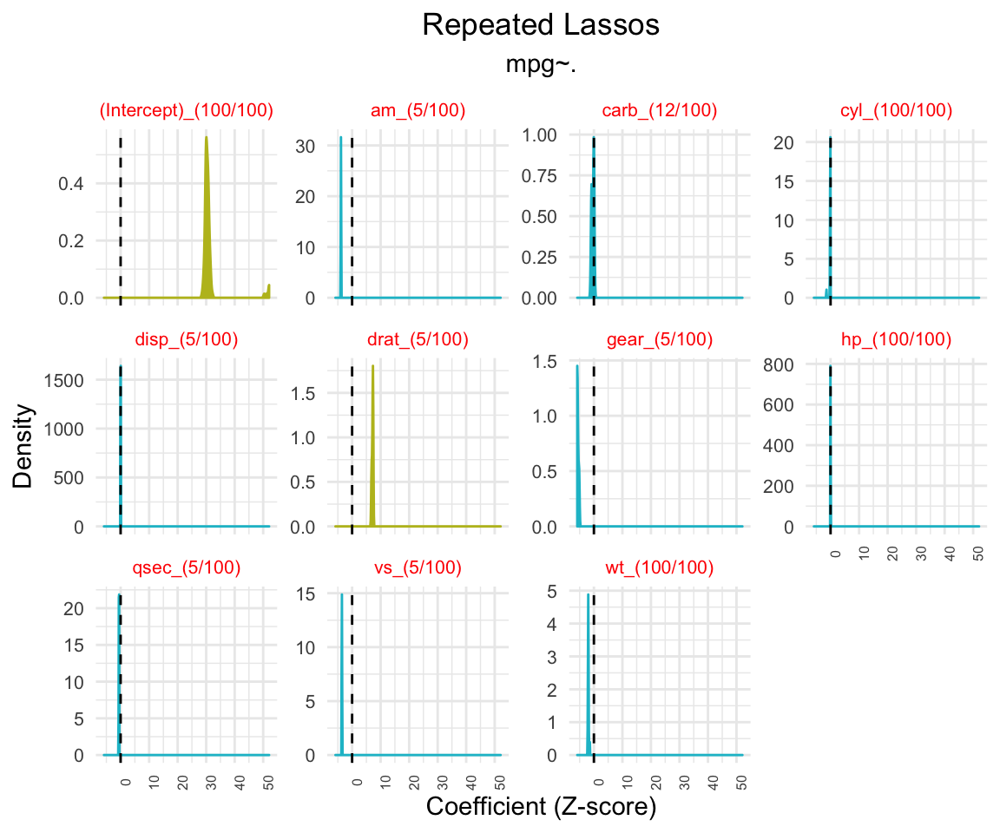
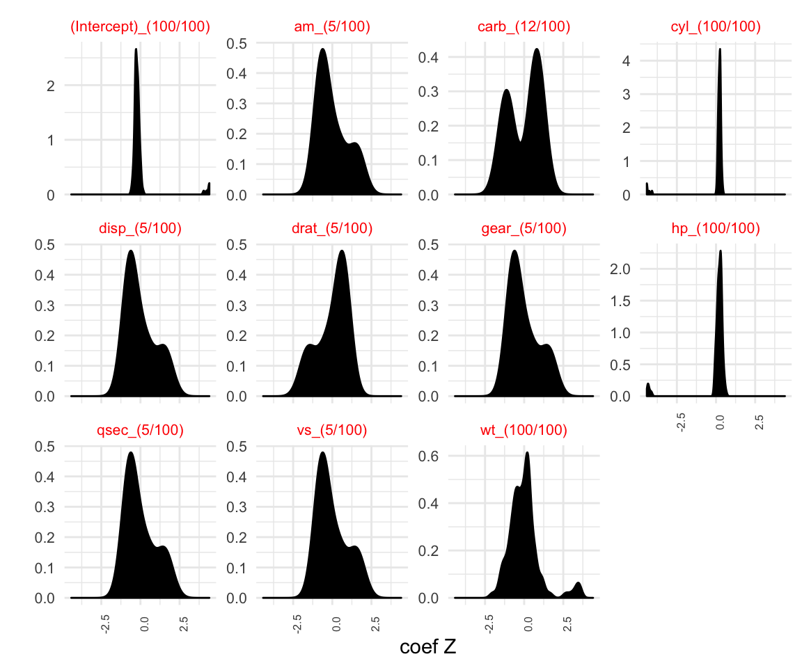
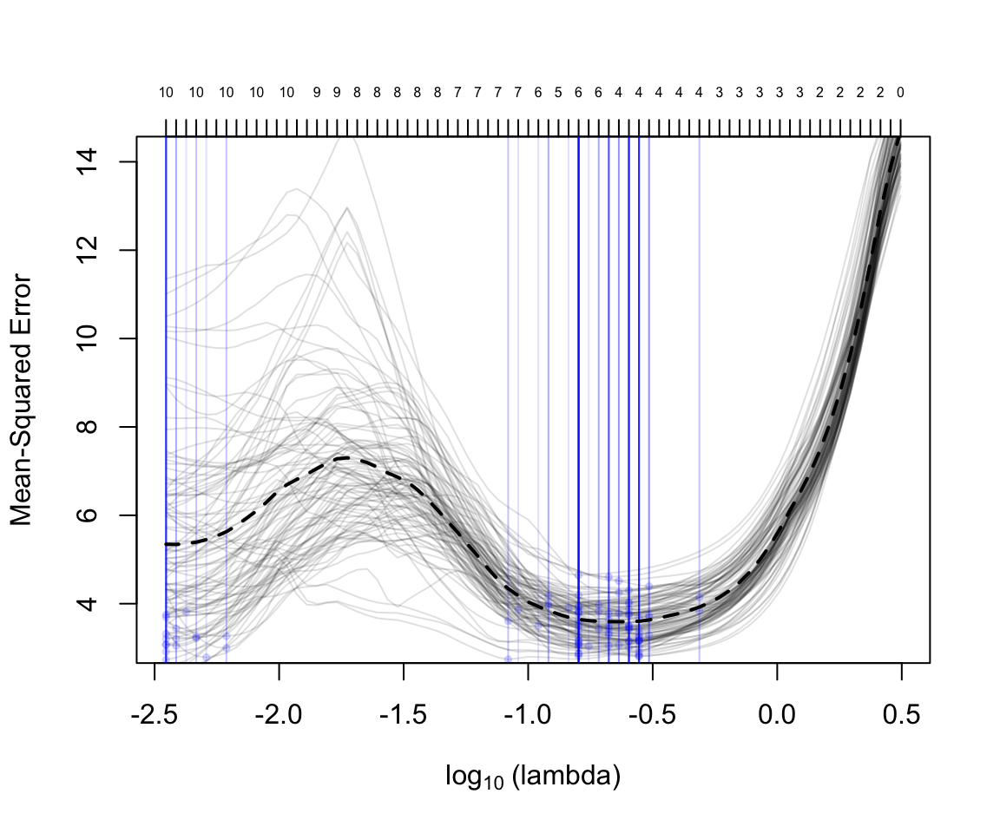
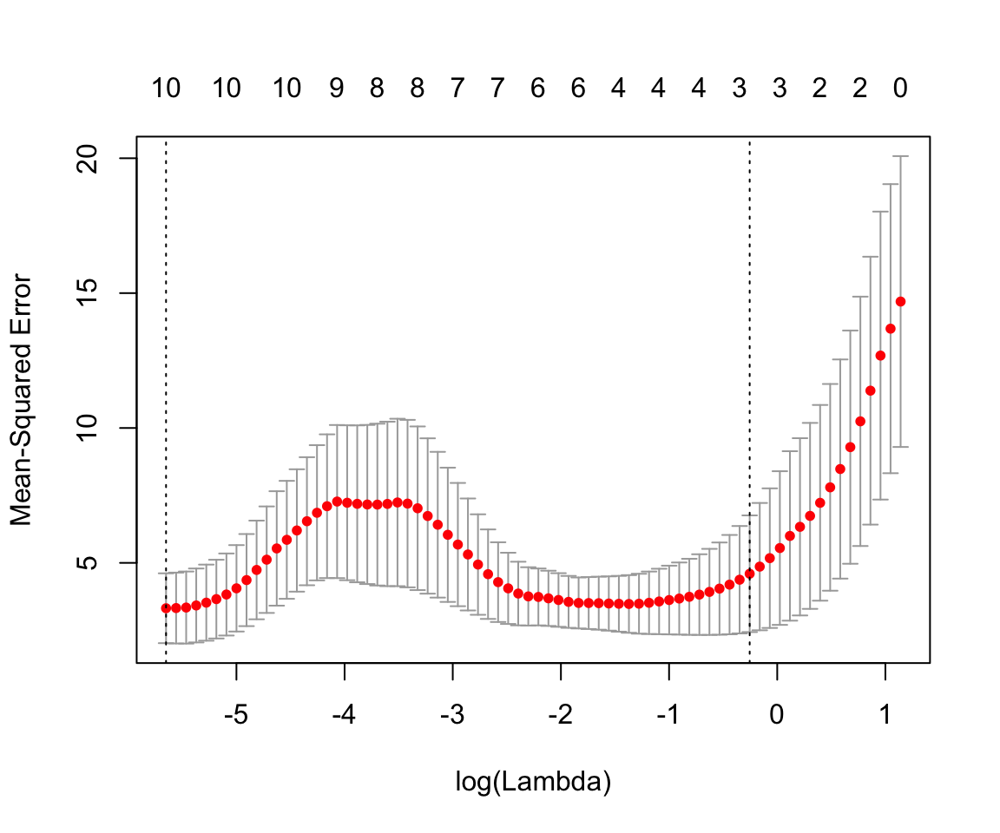

### Package: tuna

Type: Package

Title: See what may have passed through your glmnet.

Version: 0.1.0

Author: Koshlan Mayer-Blackwell

Description: Tuna makes it easy to repeat regularized regressions 
in the popular package [glmnet] (https://www.jstatsoft.org/article/view/v033i01) 
and visualize the results.  Lasso, ridge, and glmnet regressions typically use cross validation 
to determine a suitable value of the regularization hyperparameter
that minimizes the cross-validated estimate of out of sample error. 
The number of non-zero coefficients can vary depending on initialization
of coordinate gradient decent used to estimate arguments that maximize the penalized 
likelihood function. Therefore, if regularized regression is being used 
for feature selection it is worth repeating cross validation to check the consistency of the results. This is paticularly impprtant with small datasets, where the cross validation estimates may be very sensitive to outliers in the held out data fold. The idea for tuna came from an interesting discussion over coffee with K. Gillespie.

### Installation 

```r
require(devtools)
install_github("kmayerb/tuna")
```

### Usage

```{r, echo = T, warnings = F, message = F}
require(tuna)
```
Define a response vector and predictor matrix. Specify the the number of repeated trials. 
```{r}
my_y = as.matrix(mtcars[1:15,1])
my_x = as.matrix(mtcars[1:15,2:dim(mtcars)[2]])
tuna <- tuna::repeat_lasso(trials = 100, my_x = my_x, my_y=my_y )
```

Summarize the results.
```{r}
tuna::summarize_repeated_lasso(tuna)
```

```bash
   var             n     mean       sd descr                
   <fct>       <int>    <dbl>    <dbl> <chr>                
 1 (Intercept)   100 31.4     4.70     (Intercept)_(100/100)
 2 am              5 -3.90    0.0141   am_(5/100)           
 3 carb           12 -0.369   0.410    carb_(12/100)        
 4 cyl           100 -0.181   0.295    cyl_(100/100)        
 5 disp            5 -0.00190 0.000236 disp_(5/100)         
 6 drat            5  7.17    0.230    drat_(5/100)         
 7 gear            5 -5.64    0.297    gear_(5/100)         
 8 hp            100 -0.0303  0.00558  hp_(100/100)         
 9 qsec            5 -0.585   0.0159   qsec_(5/100)         
10 vs              5 -3.58    0.0265   vs_(5/100)           
11 wt            100 -1.95    0.154    wt_(100/100)   
```

### Visualize the distribution of coefficient values accross n trials

NOTE: the name of each variable includes _x/100  indicating the number of times that the variable had a non zero coefficient in the model with the minimum cross validation error. 

```{r, fig.width = 4 , fig.hieght =3}
visualize_coef_density(tuna) + ggtitle("Repeated Lassos",subtitle ="mpg~." ) +
  theme(plot.title = element_text(hjust = 0.5),
        plot.subtitle = element_text(hjust = 0.5))
```


### Visualize distribution of standardized coefficient values
```{r, fig.width = 4 , fig.hieght =3}
visualize_coef_z_density(tuna)
```


### Visualize all themean cross-validation errors 
Visualize mean cross-validation error for all values of the regularization 
parameter lambda across all n repeated trials.  
The blue lines show the value of lambda.min that mininized the cross 
validation error in a particular trial. The numbers above the plot 
indiate the number of parameters with non-zero coefficient for a given
value lamda in the first regularization trial. 
```{r, fig.width = 4 , fig.hieght =3}
visualize_all_cverror(tuna)
```  


### Tuna saves all the cvfit Results from glmnet
Tuna saves all the cvfit results from glmnet, which can be plucked for downstream analysis.
```{r, fig.width = 4 , fig.hieght =3}
i=5
plot(tuna[["fits"]][[i]])
```

